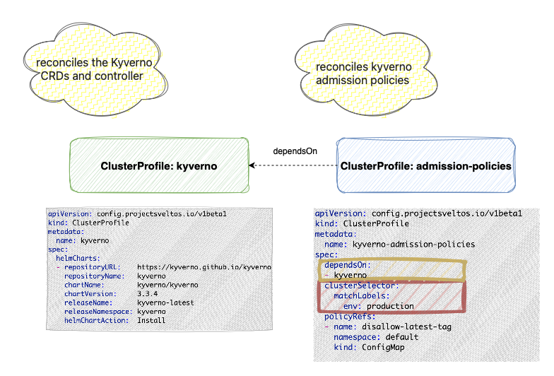
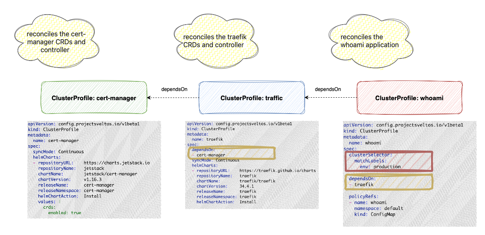
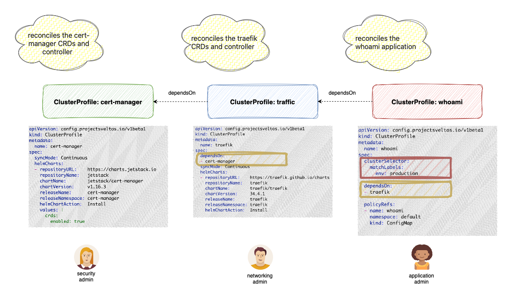
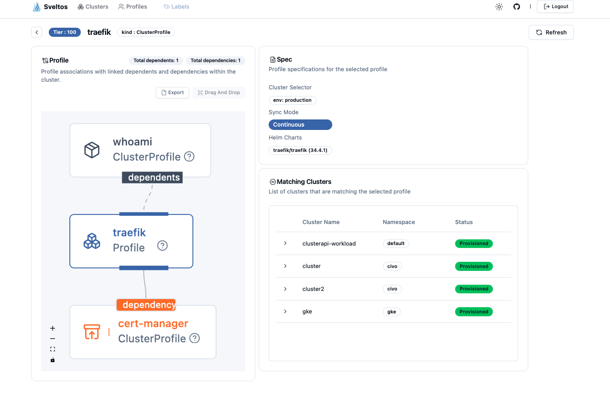
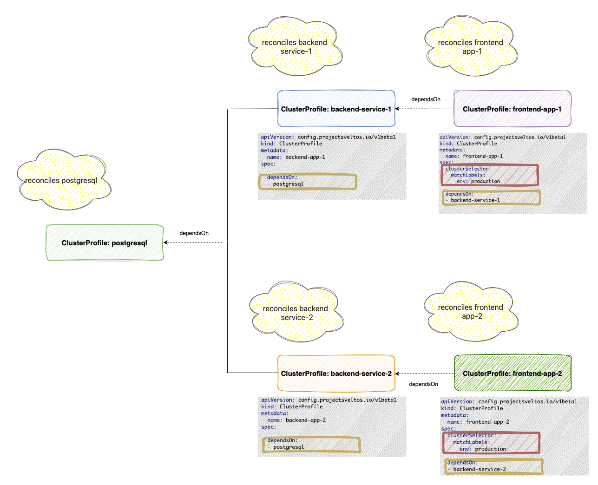

A Sveltos **ClusterProfile/Profile** is a bundle of Helm charts and Kubernetes resources that Sveltos will deploy to every cluster that matches its selection criteria.

To simplify complex deployments, Sveltos allows you to create multiple profiles and specify a deployment order using the **dependsOn** field, ensuring all profile prerequisites are met.

Consider deploying admission policies. Here are the relevant ClusterProfile snippets:

```yaml
apiVersion: config.projectsveltos.io/v1beta1
kind: ClusterProfile
metadata:
  name: kyverno
spec:
  syncMode: Continuous
  helmCharts:
  - repositoryURL:    https://kyverno.github.io/kyverno/
    repositoryName:   kyverno
    chartName:        kyverno/kyverno
    chartVersion:     3.3.4
    releaseName:      kyverno-latest
    releaseNamespace: kyverno
    ...
```

```yaml
apiVersion: config.projectsveltos.io/v1beta1
kind: ClusterProfile
metadata:
  name: admission-policies
spec:
  dependsOn:
  - kyverno
  clusterSelector:
    matchLabels:      
      env: production
  ...
```

Notice that the __kyverno__ ClusterProfile lacks a `clusterSelector`, so it won't be deployed on its own. The __admission-policies__ ClusterProfile, however, has a **clusterSelector** targeting __production clusters__ and a **dependsOn** field referencing __kyverno__. When this profile is created, Sveltos resolves its dependency. Any time a production cluster matches the __admission-policies__ selector, Sveltos will first deploy the Kyverno Helm chart and then apply the admission policies.





## Beyond Order: Verifying Application Health

While deployment order is a fundamental aspect of application dependencies, it's not always the sole requirement. In the Kyverno example, we prioritize deploying the CRDs before the custom resources, focusing on sequence. But consider a scenario where an application relies on a database. The database must not only be deployed first but also be fully initialized and ready to accept connections. In such cases, the state of the dependency becomes critical. Dependency management tools must accommodate these more complex state-based requirements.

Building on our Kyverno example, let's address the need for state-based dependencies. We want to ensure that all Kyverno deployments are fully operational before deploying admission policies. To achieve this, we add a validateHealths section to the kyverno ClusterProfile.

```yaml
apiVersion: config.projectsveltos.io/v1beta1
kind: ClusterProfile
metadata:
  name: kyverno
spec:
  syncMode: Continuous
  helmCharts:
  - repositoryURL:    https://kyverno.github.io/kyverno/
    repositoryName:   kyverno
    chartName:        kyverno/kyverno
    chartVersion:     3.3.4
    releaseName:      kyverno-latest
    releaseNamespace: kyverno
    helmChartAction:  Install
    values: |
      admissionController:
        replicas: 3
      backgroundController:
        replicas: 3
validateHealths:
- name: deployment-health
  featureID: Helm
  group: "apps"
  version: "v1"
  kind: "Deployment"
  namespace: kyverno
  script: |
    function evaluate()
      hs = {}
      hs.healthy = false
      hs.message = "available replicas not matching requested replicas"
      if obj.status ~= nil then
        if obj.status.availableReplicas ~= nil then
          if obj.status.availableReplicas == obj.spec.replicas then
            hs.healthy = true
          end
        end
      end
      return hs
    end        
```

## Recursive Resolution

One of the key strengths of Sveltos is its ability to handle complex dependency chains. Imagine an application __whoami__ that relies on __Traefik__, which itself depends on __cert-manager__. With Sveltos, you only need to define the deployment of __whoami__. Sveltos will automatically resolve the entire dependency tree, ensuring cert-manager and Traefik are deployed in the correct order before 'whoami' is deployed. This simplifies complex deployments by automating the resolution of multi-level dependencies.



This capability is especially valuable in environments where different administrators manage distinct components. For instance, the whoami application might be managed by the __application administrator__, Traefik by the __networking administrator__, and cert-manager by the __security administrator__. Sveltos eliminates the need for manual coordination, allowing each administrator to focus on their respective components while ensuring the overall deployment succeeds.



[Sveltos Dashboard](https://projectsveltos.github.io/sveltos/getting_started/optional/dashboard/) displays those dependencies



## Dependency Deduplication

Sveltos efficiently manages shared dependencies by ensuring they are deployed only once per cluster, even when multiple profiles rely on them. This optimizes resource utilization and prevents redundant deployments. Crucially, Sveltos maintains a dependency as long as any profile requiring it is active on the cluster.

Consider a 3-tier application scenario:

- Database Layer (Profile __postgresql__): Deploys a PostgreSQL database.
- Backend Layer (Profiles __backend-service-1__, __backend-service-2__): Two distinct microservices, each requiring the PostgreSQL database.
- Frontend Layer (Profiles __frontend-app-1__, __frontend-app-2__): Two frontend applications, each dependent on a respective backend service.

Here's how this translates to Sveltos profiles and dependencies:

- Profile __postgresql__: Deploys the PostgreSQL database.
- Profile __backend-service-1__: Depends on Profile postgresql.
- Profile __frontend-app-1__: Depends on Profile backend-service-1.
- Profile __backend-service-2__: Depends on Profile postgresql.
- Profile __frontend-app-2__: Depends on Profile backend-service-2.



### Deployment Sequence:

When __frontend-app-1__ is deployed, Sveltos first deploys __postgresql__ and then __backend-service-1__, resolving the dependency chain.
Subsequently, when __frontend-app-2__ is deployed to the same cluster, Sveltos recognizes that postgresql is already present and avoids redeploying it.
If __frontend-app-1__ is then removed, __backend-service-1__ is also removed. However, __postgresql__ persists because it remains a dependency of __frontend-app-2__.
Finally, only when __frontend-app-2__ is removed will Sveltos remove __backend-service-2__ and __postgresql__, as they are no longer required by any active profile on the cluster.