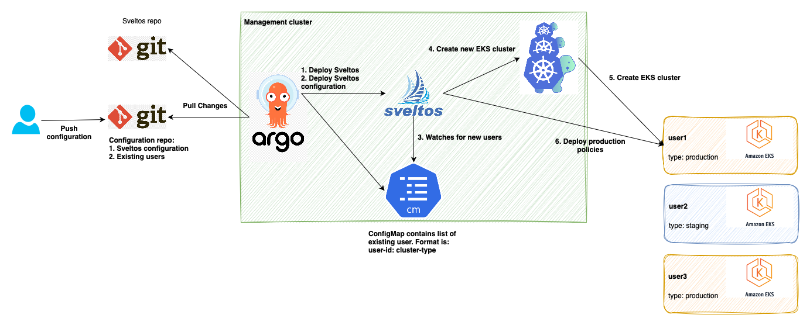
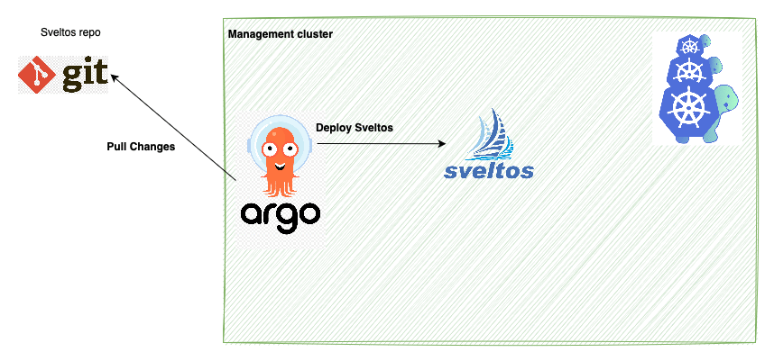
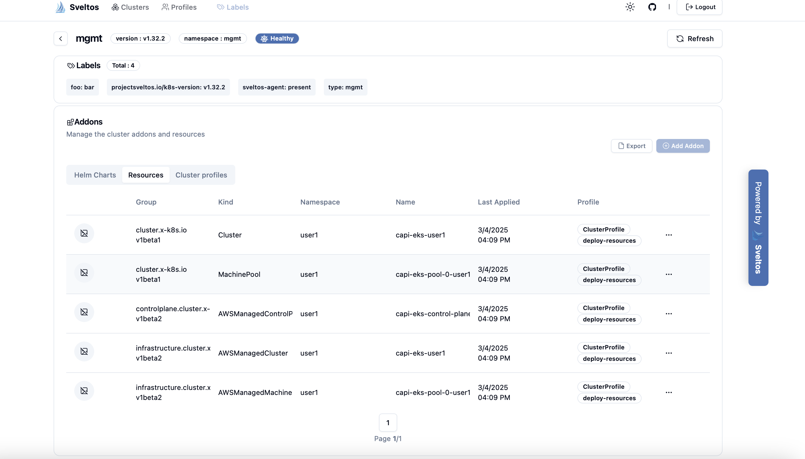
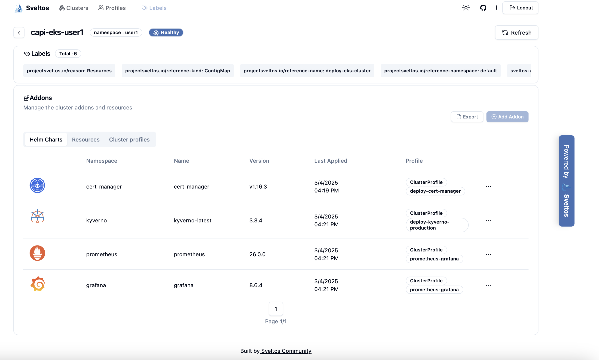

Imagine a scenario where you need to provide dedicated Kubernetes environments to individual users or teams on demand. Manually creating and managing these clusters can be time-consuming and error-prone. In this tutorial, we'll demonstrate how to automate this process using a powerful combination of ArgoCD, Sveltos, and ClusterAPI. We'll set up a GitOps workflow where adding a new user via a pull request triggers the automatic provisioning of a dedicated EKS cluster. ArgoCD will maintain the desired state of our management cluster, Sveltos will detect changes and orchestrate cluster creation, and ClusterAPI will handle the provisioning of the EKS clusters. This tutorial will provide a hands-on experience in building a robust and scalable cluster provisioning pipeline.



### Argo


[Argo CD](https://github.com/argoproj/argo-cd) is an open-source, continuous delivery (CD) tool for Kubernetes that automates the deployment, monitoring, and rollback of applications. It is a declarative tool that uses GitOps principles to ensure that the desired state of an application is always reflected in the actual state of the Kubernetes Management or Workload cluster.

### Sveltos


[Sveltos](https://github.com/projectsveltos) is a set of Kubernetes controllers operating within a management cluster. From this central point, Sveltos manages add-ons and applications across a fleet of managed Kubernetes clusters. It employs a declarative approach, ensuring that the desired state is consistently reflected across these managed environments.

### ClusterAPI


[ClusterAPI](https://github.com/kubernetes-sigs/cluster-api) (CAPI) is a Kubernetes sub-project that brings declarative, Kubernetes-style APIs to cluster creation, configuration, and management. It allows you to manage the lifecycle of Kubernetes clusters using the same declarative approach you use for managing applications.

## Step 1: Install ClusterAPI on Management Cluster

We'll use a Kind cluster as our management cluster. To begin, we need to deploy ClusterAPI with the AWS infrastructure provider.
First, configure your AWS credentials:

```bash
export AWS_ACCESS_KEY_ID=<YOUR ACCESS KEY>
export AWS_SECRET_ACCESS_KEY=<YOUR SECRET ACCESS KEY>
clusterawsadm bootstrap iam create-cloudformation-stack --region us-east-1
export AWS_B64ENCODED_CREDENTIALS=$(clusterawsadm bootstrap credentials encode-as-profile)
```

Then, initialize ClusterAPI:

```bash
export AWS_REGION=us-east-1
export EKS=true
export EXP_MACHINE_POOL=true
export CAPA_EKS_IAM=true
export AWS_CONTROL_PLANE_MACHINE_TYPE=t3.large
export AWS_NODE_MACHINE_TYPE=t3.large
export AWS_REGION=us-east-1
export AWS_SSH_KEY_NAME=capi-eks
clusterctl init --infrastructure aws
```

## Step 2: Install ArgoCD on Management Cluster

```bash
kubectl create namespace argocd
kubectl apply -n argocd -f https://raw.githubusercontent.com/argoproj/argo-cd/stable/manifests/install.yaml
kubectl config set-context --current --namespace=argocd
kubectl port-forward svc/argocd-server -n argocd 8080:443
```

The admin password to connect to ArgoCD dashboard is in the Secret named `argocd-initial-admin-secret` in the argocd namespace.

## Step 3: Deploy Sveltos

We will leverage Argo CD to automate the deployment of Sveltos onto your management Kubernetes cluster.

```bash
argocd app create sveltos --repo https://github.com/projectsveltos/helm-charts.git --path charts/projectsveltos --dest-server https://kubernetes.default.svc --dest-namespace projectsveltos
```

This directs Argo CD to create an application named sveltos, retrieving the Sveltos Helm chart from the specified GitHub repository and deploying it to the `projectsveltos` namespace within the management cluster. Next, we'll deploy the Sveltos configurations using Argo CD.

```bash
argocd app create sveltos-configuration --repo https://github.com/gianlucam76/devops-tutorial.git --path argocd-sveltos-clusterapi-eks --dest-server https://kubernetes.default.svc
```

The Sveltos configuration we're deploying establishes a dynamic cluster creation process. First, it monitors a ConfigMap named `existing-users` within the default namespace. This ConfigMap maintains a list of users, each entry formatted as `user-id: cluster-type`, where cluster-type designates either `production` or `staging`. Subsequently, whenever a new user entry is detected in this ConfigMap, Sveltos triggers the deployment of a ClusterAPI configuration, which in turn initiates the creation of a new EKS cluster. Importantly, each newly created cluster will be labeled with type:cluster-type, allowing Sveltos to immediately apply the appropriate configuration, whether for production or staging environments, based on the cluster's label.

Before we proceed further, label the management cluster with `type: mgmt``

```bash
kubectl label sveltoscluster -n mgmt mgmt type=mgmt
```

## Step 4: Push a PR to add a new user

To add a new user and trigger the creation of a corresponding EKS cluster, we will implement a straightforward GitOps workflow. First, we'll submit a pull request (PR) that modifies the `existing-users.yaml` ConfigMap within our repository. Specifically, this PR will introduce a new user entry, `user1: production`, within the data section of the ConfigMap, as shown in the provided diff. 

```diff
diff --git a/argocd-sveltos-clusterapi-eks/existing-users.yaml b/argocd-sveltos-clusterapi-eks/existing-users.yaml
index ab0d862..10987b3 100644
--- a/argocd-sveltos-clusterapi-eks/existing-users.yaml
+++ b/argocd-sveltos-clusterapi-eks/existing-users.yaml
@@ -3,3 +3,5 @@ kind: ConfigMap
 metadata:
   name: existing-users
   namespace: default
+data:
+  user1: production
```

Once the PR is merged, we'll then instruct Argo CD to synchronize these changes to the management cluster. This synchronization will apply the updated ConfigMap, thereby signaling Sveltos to initiate the ClusterAPI-driven provisioning of a new production EKS cluster for `user1`.



## Step 5: Sveltos triggers creation of a new EKS cluster

Sveltos will immediately detect the new user entry, `user1: production`. This detection triggers Sveltos to deploy all the necessary ClusterAPI resources to the management cluster, effectively orchestrating the creation of a new EKS cluster. Executing sveltosctl show addons will then reveal the deployed resources, as shown below:

```bash
sveltosctl show addons
+-----------+-------------------------------------------------------+-----------+------------------------------+---------+-------------------------------+---------------------------------+
|  CLUSTER  |                     RESOURCE TYPE                     | NAMESPACE |             NAME             | VERSION |             TIME              |            PROFILES             |
+-----------+-------------------------------------------------------+-----------+------------------------------+---------+-------------------------------+---------------------------------+
| mgmt/mgmt | cluster.x-k8s.io:Cluster                              | user1     | capi-eks-user1               | N/A     | 2025-03-04 12:10:02 +0100 CET | ClusterProfile/deploy-resources |
| mgmt/mgmt | infrastructure.cluster.x-k8s.io:AWSManagedCluster     | user1     | capi-eks-user1               | N/A     | 2025-03-04 12:10:02 +0100 CET | ClusterProfile/deploy-resources |
| mgmt/mgmt | controlplane.cluster.x-k8s.io:AWSManagedControlPlane  | user1     | capi-eks-control-plane-user1 | N/A     | 2025-03-04 12:10:02 +0100 CET | ClusterProfile/deploy-resources |
| mgmt/mgmt | cluster.x-k8s.io:MachinePool                          | user1     | capi-eks-pool-0-user1        | N/A     | 2025-03-04 12:10:02 +0100 CET | ClusterProfile/deploy-resources |
| mgmt/mgmt | infrastructure.cluster.x-k8s.io:AWSManagedMachinePool | user1     | capi-eks-pool-0-user1        | N/A     | 2025-03-04 12:10:02 +0100 CET | ClusterProfile/deploy-resources |
+-----------+-------------------------------------------------------+-----------+------------------------------+---------+-------------------------------+---------------------------------+
```

Sveltos dashboard can also be used to see what Sveltos has deployed to the management cluster:



## Step 6: Sveltos deploys production policies

Once ClusterAPI completes the provisioning of the new EKS cluster, Sveltos will automatically deploy the add-ons configured for a production environment. This deployment includes:

- The cert-manager Helm chart, to manage and issue TLS certificates.
- The kyverno Helm chart, for policy-based control of Kubernetes resources.
- The prometheus and grafana Helm charts, to provide monitoring and visualization capabilities.
- A kyverno admission policy specifically configured to disallow-latest-tag, enforcing the use of explicit image tags for container deployments.

```bash
sveltosctl show addons --namespace=user1
+----------------------+--------------------------+--------------+---------------------+---------+-------------------------------+------------------------------------------+
|       CLUSTER        |      RESOURCE TYPE       |  NAMESPACE   |        NAME         | VERSION |             TIME              |                 PROFILES                 |
+----------------------+--------------------------+--------------+---------------------+---------+-------------------------------+------------------------------------------+
| user1/capi-eks-user1 | helm chart               | cert-manager | cert-manager        | v1.16.3 | 2025-03-04 12:28:00 +0100 CET | ClusterProfile/deploy-cert-manager       |
| user1/capi-eks-user1 | helm chart               | prometheus   | prometheus          | 26.0.0  | 2025-03-04 12:29:20 +0100 CET | ClusterProfile/prometheus-grafana        |
| user1/capi-eks-user1 | helm chart               | grafana      | grafana             | 8.6.4   | 2025-03-04 12:29:29 +0100 CET | ClusterProfile/prometheus-grafana        |
| user1/capi-eks-user1 | helm chart               | kyverno      | kyverno-latest      | 3.3.4   | 2025-03-04 12:28:50 +0100 CET | ClusterProfile/deploy-kyverno-production |
| user1/capi-eks-user1 | kyverno.io:ClusterPolicy |              | disallow-latest-tag | N/A     | 2025-03-04 12:29:19 +0100 CET | ClusterProfile/deploy-kyverno-resources  |
+----------------------+--------------------------+--------------+---------------------+---------+-------------------------------+------------------------------------------+
```

You can also view deployed Helm charts within the Sveltos dashboard.



## Step 7: Removing user

Just as easily as we created a cluster by adding a user, we can remove a user and, consequently, delete their associated EKS cluster. This is achieved through the same GitOps workflow, but in reverse.

To remove a user, we simply submit a pull request (PR) that removes the user's entry from the `existing-users.yaml` ConfigMap. For example, to remove `user1`, we would revert the changes we made in Step 4. Once this PR is merged and Argo CD synchronizes the changes to the management cluster, Sveltos detects the removal of the user from the ConfigMap.

Sveltos, upon detecting this change, proceeds to delete all the ClusterAPI resources it previously deployed for that user. This includes the `Cluster`, `AWSManagedCluster`, `AWSManagedControlPlane`, `MachinePool`, and `AWSManagedMachinePool` resources within the user's namespace (in this case, "user1").

Because ClusterAPI operates declaratively, deleting these ClusterAPI resources triggers the deletion of the underlying EKS cluster. ClusterAPI's AWS infrastructure provider interprets the removal of these resources as a request to terminate the corresponding cloud resources.

Therefore, by simply removing the user entry from the existing-users.yaml ConfigMap and allowing Argo CD and Sveltos to synchronize the changes, we effectively automate the entire lifecycle of the EKS cluster, from creation to deletion. This ensures that resources are efficiently managed and that orphaned clusters are avoided, maintaining a clean and cost-effective environment.

## Conclusion

In this tutorial, we've demonstrated how to build a fully automated, GitOps-driven pipeline for provisioning dedicated EKS clusters on demand. By leveraging the power of Argo CD, Sveltos, and ClusterAPI, we've established a robust and scalable solution that eliminates the manual effort and potential errors associated with traditional cluster management.
We've seen how:

- Argo CD maintains the desired state of our management cluster, ensuring that all configurations are synchronized with our Git repository.
- Sveltos acts as a dynamic orchestrator, detecting changes in our user configuration and triggering the creation of new EKS clusters.
- ClusterAPI handles the heavy lifting of provisioning and managing the EKS clusters themselves, providing a consistent and declarative approach.

## Contact Information

If you have some questions, would like to have a friendly chat or just network to not miss any topics, then don't use the comment function at medium, just feel free to add me to your [LinkedIn](https://www.linkedin.com/in/gianlucamardente/) network!