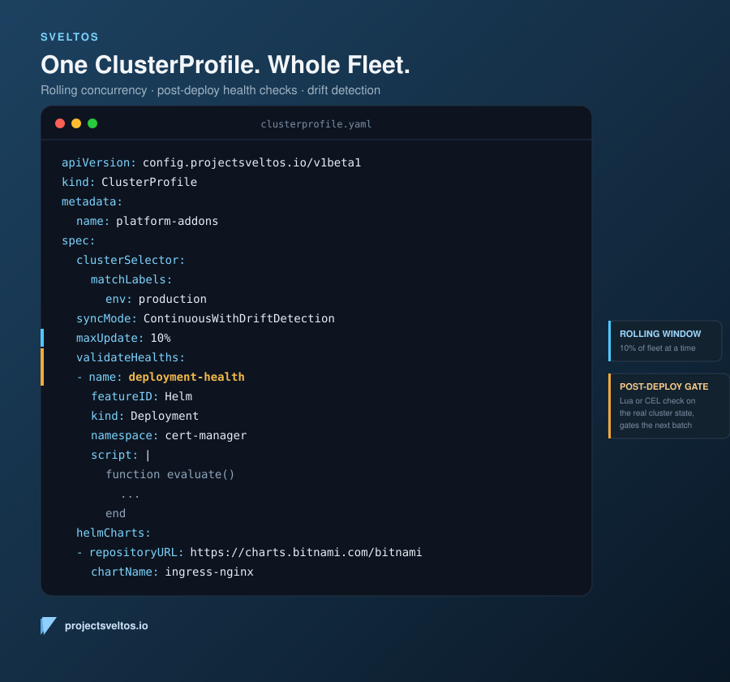
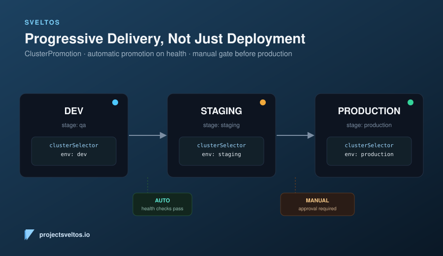

# Fleet Management, Not Just Cluster Management

**TL;DR**: Provisioning clusters and pushing add-ons to them is a solved problem. Controlling how a change moves *safely* across hundreds of them, so one bad rollout doesn't land on your whole fleet at once, is not, for most tools. This post walks through how [Project Sveltos](https://github.com/projectsveltos) approaches that second problem today, with two building blocks: a `ClusterProfile` that rolls a change out gradually and gives up on clusters that won't take it, and a `ClusterPromotion` pipeline that walks a change through dev, staging, and production with health checks and approvals gating every step.

## Cluster Management vs. Fleet Management

Most of the Kubernetes multi-cluster tooling landscape solves one of two problems well:

- **Cluster lifecycle**: turning infrastructure into a running cluster (Cluster API, managed platforms).
- **Add-on delivery**: getting Helm charts and manifests onto clusters that already exist (Argo CD ApplicationSets, Rancher Fleet, and Sveltos itself).

What's harder to find is the layer above both of those: **fleet management**, treating "roll this change out to 500 clusters" as a single, governed operation instead of 500 independent deployments that happen to share a Git commit. That means pacing the rollout, stopping it when something's clearly wrong, and moving a change through environments deliberately instead of firing it at every matching cluster the instant a label matches.

Sveltos treats this as a first-class part of the add-on delivery story, not a separate product. Two fields on `ClusterProfile` and one CRD, `ClusterPromotion`, cover most of it.

## Rolling Out Without Rolling Over the Whole Fleet

A `ClusterProfile` targets clusters by label selector, so "which clusters get this" is already decoupled from "how many at once." Two spec fields turn that into a controlled rollout:



```yaml
apiVersion: config.projectsveltos.io/v1beta1
kind: ClusterProfile
metadata:
  name: platform-addons
spec:
  clusterSelector:
    matchLabels:
      env: production
  syncMode: ContinuousWithDriftDetection
  maxUpdate: 10%
  validateHealths:
  - name: deployment-health
    featureID: Helm
    group: "apps"
    version: "v1"
    kind: "Deployment"
    namespace: cert-manager
    script: |
      function evaluate()
        local hs = {healthy = false, message = "available replicas not matching requested replicas"}
        if obj.status and obj.status.availableReplicas ~= nil and obj.status.availableReplicas == obj.spec.replicas then
          hs.healthy = true
        end
        return hs
      end
  helmCharts:
  - repositoryURL: https://charts.bitnami.com/bitnami
    chartName: ingress-nginx
    chartVersion: 4.11.3
    releaseName: ingress
    releaseNamespace: ingress
```

**`maxUpdate`** caps how many clusters are being updated concurrently, as a count or a percentage of the matching fleet. It's not a fixed batch that waits for everyone to finish before starting the next one: as soon as one cluster reaches `Provisioned`, Sveltos immediately pulls the next matching cluster into the window. On a 200-cluster fleet with `maxUpdate: 10%`, that's 20 clusters in flight at any moment, continuously replenished as each one succeeds, not 10 sequential waves of 20.

**`validateHealths`** is what keeps that window from being filled with clusters that only look done. Each entry runs a Lua script (or a CEL expression, or a Job) against the actual object Sveltos just deployed in the managed cluster, not against Sveltos's own bookkeeping. The example above reads the live `Deployment` cert-manager's Helm chart created and only reports healthy once `status.availableReplicas` actually matches `spec.replicas`, not just because `helm upgrade` returned success. A cluster only reaches `Provisioned`, and only then frees its slot in `maxUpdate`'s window, once that check reports healthy. The same `ValidateHealth` type also powers `preDeployChecks` (run before a change is applied, to block deploying into a cluster that isn't ready for it) and the pre/post checks `ClusterPromotion` runs around each stage, covered below. Full reference: [Deployment Order With Health Checks](https://projectsveltos.io/main/deployment_order/depends_on_with_health_checks/).

Together, these turn `syncMode: ContinuousWithDriftDetection` from "push everywhere as fast as the API server allows" into a paced rollout where a cluster that comes up unhealthy stays visibly stuck instead of being counted as done, without stopping progress on the rest of the fleet.

What makes this combination work is that `maxUpdate` on its own only controls throughput, not correctness. Left alone, a window will happily fill up with clusters that are "done" the moment `helm upgrade` or a resource apply returns without error, whether or not the workload actually came up. `validateHealths` moves the definition of done from "the API server accepted the write" to "the object I created is in the state I expect," evaluated against the live object in the managed cluster on every reconcile, not against a one-time exit code. That's the only signal that catches a `CrashLoopBackOff`, a `Job` that ran and failed, or a webhook that silently rejected part of a chart's manifests. Because `Provisioned` depends on that check, a cluster stuck in a bad state keeps occupying its `maxUpdate` slot instead of quietly counting toward "rolled out."

## Progressive Delivery Across Environments

`maxUpdate` and `validateHealths` control *how* a rollout to one group of clusters behaves. `ClusterPromotion` controls *when* a change is allowed to reach the next group at all.



```yaml
apiVersion: config.projectsveltos.io/v1beta1
kind: ClusterPromotion
metadata:
  name: platform-addons-pipeline
spec:
  profileSpec:
    syncMode: ContinuousWithDriftDetection
    helmCharts:
    - repositoryURL: https://charts.bitnami.com/bitnami
      chartName: ingress-nginx
      chartVersion: 4.11.3
      releaseName: ingress
      releaseNamespace: ingress
  stages:
  - name: dev
    clusterSelector:
      matchLabels:
        env: dev
    trigger:
      auto:
        postDelayHealthChecks:
        - name: ingress-ready
          featureID: Helm
  - name: staging
    clusterSelector:
      matchLabels:
        env: staging
    trigger:
      manual: {}
  - name: production
    clusterSelector:
      matchLabels:
        env: production
```

Each stage is backed by its own `ClusterProfile`, scoped to its own `clusterSelector`, created and managed by the `ClusterPromotion` controller. A stage doesn't advance until every matching cluster in it reaches `Provisioned` *and* its trigger condition is satisfied:

- **`auto`** stages promote on their own once post-deploy health checks pass. The `dev` stage above waits for the ingress controller to actually report ready before staging ever sees the change.
- **`manual`** stages wait for a human to flip `approved: true`. Nothing reaches production because a health check happened to pass at 2am; someone has to say so.

The effect is that a broken chart version gets caught in `dev`, against a handful of clusters, before `staging`'s `clusterSelector` is ever evaluated, let alone production's. The blast radius of a bad change is bounded by which stage it's in, not by how fast the reconciler loop runs.

What makes this a different mechanism than `maxUpdate`, rather than a restatement of it, is where the containment lives. `maxUpdate` limits concurrency within a fixed set of clusters that were always going to get the change. `ClusterPromotion` controls whether a set of clusters gets evaluated at all: `staging`'s `ClusterProfile` is not created, and `production`'s never sees the new `profileSpec`, until the prior stage's trigger condition is met. That's enforced by what the `ClusterPromotion` controller reconciles, not by a convention an operator has to remember to follow. It also collapses what would otherwise be separate `ClusterProfile` objects, one per environment, manually kept in sync, into one `profileSpec` shared by every stage, so `dev`, `staging`, and `production` are guaranteed to diverge only in which clusters they target, never in what gets deployed to them.

## Pacing and Gating, One Model

`maxUpdate` and `validateHealths` answer "how carefully do we roll this out within a group of clusters." `ClusterPromotion` answers "which group of clusters should even see this yet." Used together, a chart update lands on a couple of dev clusters first, gets paced by `maxUpdate` and checked by `validateHealths` if `dev` itself has more than a handful of clusters, clears an automatic health gate, waits for a human before touching staging, and only reaches production once someone's actually looked at it. All of that is declared once, in one pipeline, instead of stitched together with separate Git branches and CI stages per environment.

That's the fleet management piece Sveltos adds on top of "deploy this Helm chart to clusters matching this label": not just *what* gets deployed where, but the pacing and gating that keep a bad rollout from becoming a fleet-wide incident.

Docs: [projectsveltos.io](https://projectsveltos.io) &middot; Source: [github.com/projectsveltos](https://github.com/projectsveltos)
