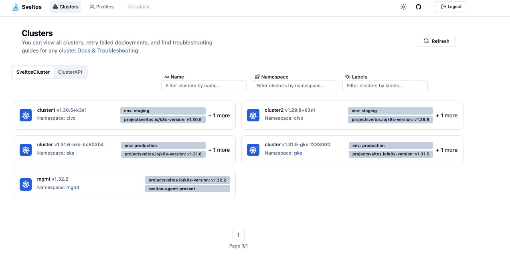

[Kro](https://kro.run/docs/overview), or Kube Resource Orchestrator, is an open-source Kubernetes project designed to simplify the deployment and management of complex applications on Kubernetes.


Kro's installation introduces the **ResourceGraphDefinition** CustomResourceDefinition, enabling teams to build custom APIs. By defining custom resources within the RGD, teams can create abstractions like 'ApplicationStack', which encapsulate complex deployments. This simplifies Kubernetes for developers, who can then interact with high-level APIs instead of managing low-level resources.

In the above example, the **Platform Team** has created a Resource Group named `Application Stack` that encapsulates the necessary resources, along with any additional logic, abstractions, and security best practices. 
When the ResourceGraphDefinition instance is applied to the cluster, a new API of kind ApplicationStack is created and available for Developer to interact with. The Developers no longer need to directly manage the underlying infrastructure complexities, as the custom API handles the deployment and configuration of the required resources.

Using kro, the Platform Team can enable Developer teams to quickly deploy and manage applications and their dependencies as one unit, handling the entire lifecycle from deployment to maintenance. 

## Managing a Fleet of Clusters

[Sveltos](https://github.com/projectsveltos) automates and scales Kro deployments across multiple clusters. 

Platform and security teams configure Kro and ResourceGroupDefinitions through ClusterProfiles, **deferring** target cluster selection because at this stage they don't know where the dependent applications will be deployed, and importantly, because Kro should only be deployed on clusters where it's actually needed.

Application admins, who possess the knowledge of application deployment locations, then create deployment-specific profiles, selecting target clusters and declaring dependencies on the pre-defined ResourceGroupDefinitions. 

Sveltos automates the process, identifying matching clusters, resolving dependencies, and deploying Kro, ResourceGroupDefinitions, and applications in the correct order across the matching clusters.


## Exploring Kro and Sveltos in Action

Lets see Kro and Sveltos in practical scenarios.

## Step 1: Install Sveltos on Management Cluster

Sveltos installation details can be found [here](https://projectsveltos.github.io/sveltos/getting_started/install/install/).
For this demo we will use helm, so while pointing to the management cluster

```bash
helm repo add projectsveltos https://projectsveltos.github.io/helm-charts
helm repo update
helm install projectsveltos projectsveltos/projectsveltos -n projectsveltos --create-namespace
```

## Step 2: Register Managed Clusters with Sveltos

For this tutorial, I'm using a GKE cluster and an EKS cluster as production environments, along with two Civo clusters for staging. 
To register these clusters for Sveltos management, you'll need their respective Kubeconfigs. Use the following commands, adjusting namespace, cluster name, Kubeconfig path, and labels accordingly:

```
sveltosctl register cluster --namespace=<namespace> --cluster=<cluster name> \
    --kubeconfig=<path to file with Kubeconfig> \
    --labels=env=production
```

```
sveltosctl register cluster --namespace=<namespace> --cluster=<cluster name> \
    --kubeconfig=<path to file with Kubeconfig> \
    --labels=env=staging
```

Verify all clusters are correctly registered:

```bash
kubectl get sveltoscluster -A --show-labels
NAMESPACE   NAME       READY   VERSION               LABELS
civo        cluster1   true    v1.30.5+k3s1          env=staging,projectsveltos.io/k8s-version=v1.30.5,sveltos-agent=present
civo        cluster2   true    v1.29.8+k3s1          env=staging,projectsveltos.io/k8s-version=v1.29.8,sveltos-agent=present
eks         cluster    true    v1.31.6-eks-bc803b4   env=production,projectsveltos.io/k8s-version=v1.31.6,sveltos-agent=present
gke         cluster    true    v1.31.5-gke.1233000   env=production,projectsveltos.io/k8s-version=v1.31.5,sveltos-agent=present
mgmt        mgmt       true    v1.32.2               projectsveltos.io/k8s-version=v1.32.2,sveltos-agent=present
```

## Step 3: Configuring Kro Deployment with a ClusterProfile 

This ClusterProfile configures Sveltos for Kro deployment, but intentionally omits a `clusterSelector`. The platform administrator is deferring cluster selection until the specific need for Kro on managed clusters becomes clear.

```yaml
apiVersion: config.projectsveltos.io/v1beta1
kind: ClusterProfile
metadata:
  name: deploy-kro
spec:
  syncMode: Continuous
  helmCharts:
  - repositoryURL:    oci://ghcr.io/kro-run/kro
    repositoryName:   kro
    chartName:        kro
    chartVersion:     0.2.1
    releaseName:      kro
    releaseNamespace: kro
    helmChartAction:  Install  
```

To apply this ClusterProfile to your management cluster, use the following command:

```
kubectl apply -f https://raw.githubusercontent.com/gianlucam76/devops-tutorial/refs/heads/main/kro/clusterprofile-deploy-kro.yaml
```

## Step 4: Configuring Kro ResourceGroupDefinition with a ClusterProfile

This ClusterProfile configures Sveltos to deploy the Kro ResourceGraphDefinition. 
It intentionally omits a `clusterSelector`, as the target clusters are determined later when Kro's necessity on managed clusters is known. 
Crucially, this profile also declares a **dependency** on the `deploy-kro` ClusterProfile, ensuring Kro is installed before the ResourceGraphDefinition.

```yaml
apiVersion: config.projectsveltos.io/v1beta1
kind: ClusterProfile
metadata:
  name: deploy-kro-resource-graph-defintion
spec:
  dependsOn:
  - deploy-kro 
  ...
```

To apply this ClusterProfile to your management cluster, use the following command:

```
kubectl apply -f https://raw.githubusercontent.com/gianlucam76/devops-tutorial/refs/heads/main/kro/clusterprofile-deploy-resource-graph-defintion.yaml
```

## Step 5: Configuring Kro Application with a ClusterProfile

In this step, we'll deploy a Kro application specifically to our staging clusters using a ClusterProfile.

```yaml
apiVersion: config.projectsveltos.io/v1beta1
kind: ClusterProfile
metadata:
  name: deploy-kro-application-staging
spec:
  dependsOn:
  - deploy-kro-resource-graph-defintion
  clusterSelector:
    matchLabels:
      env: staging
  ...
```

As you can see, the **clusterSelector** field targets clusters with the _env: staging_ label, ensuring the application is deployed only to those environments. 
The **dependsOn** field specifies that the _deploy-kro-resource-graph-defintion_ ClusterProfile must be applied first, guaranteeing the necessary ResourceGraphDefinition is in place.

Sveltos handles the dependency resolution automatically, creating a Directed Acyclic Graph (DAG) to ensure all required profiles are deployed in the correct order to the selected staging clusters.

To apply this ClusterProfile to your management cluster, execute the following command:

```
kubectl apply -f https://raw.githubusercontent.com/gianlucam76/devops-tutorial/refs/heads/main/kro/clusterprofile-deploy-application-staging.yaml
```

After applying the ClusterProfile, you can verify the deployment using `sveltosctl show addons`. The output should resemble the following:

```bash
sveltosctl show addons
+---------------+---------------------------------+-----------+-------------------------+---------+-------------------------------+----------------------------------------------------+
|    CLUSTER    |          RESOURCE TYPE          | NAMESPACE |          NAME           | VERSION |             TIME              |                      PROFILES                      |
+---------------+---------------------------------+-----------+-------------------------+---------+-------------------------------+----------------------------------------------------+
| civo/cluster1 | helm chart                      | kro       | kro                     | 0.2.1   | 2025-03-12 13:49:42 +0100 CET | ClusterProfile/deploy-kro                          |
| civo/cluster1 | kro.run:ResourceGraphDefinition |           | my-application          | N/A     | 2025-03-12 13:49:50 +0100 CET | ClusterProfile/deploy-kro-resource-graph-defintion |
| civo/cluster1 | kro.run:Application             | default   | my-application-instance | N/A     | 2025-03-12 13:50:07 +0100 CET | ClusterProfile/deploy-kro-application-staging      |
| civo/cluster2 | helm chart                      | kro       | kro                     | 0.2.1   | 2025-03-12 13:49:42 +0100 CET | ClusterProfile/deploy-kro                          |
| civo/cluster2 | kro.run:Application             | default   | my-application-instance | N/A     | 2025-03-12 13:49:56 +0100 CET | ClusterProfile/deploy-kro-application-staging      |
| civo/cluster2 | kro.run:ResourceGraphDefinition |           | my-application          | N/A     | 2025-03-12 13:49:50 +0100 CET | ClusterProfile/deploy-kro-resource-graph-defintion |
+---------------+---------------------------------+-----------+-------------------------+---------+-------------------------------+----------------------------------------------------+
```

This output confirms that Kro, the ResourceGraphDefinition, and the application have been successfully deployed to both civo/cluster1 and civo/cluster2, our staging clusters.

## Step 6: Deploy Kro Application to production clusters

Now, let's extend our deployment to the production environments. We'll use another ClusterProfile to deploy the Kro application to our production clusters.

```yaml
apiVersion: config.projectsveltos.io/v1beta1
kind: ClusterProfile
metadata:
  name: deploy-kro-application-production
spec:
  dependsOn:
  - deploy-kro-resource-graph-defintion
  clusterSelector:
    matchLabels:
      env: production
```

This ClusterProfile, much like the staging one, uses a **clusterSelector**. Here, it targets clusters with the label _env: production_, ensuring the application is deployed only to your production clusters. 
The **dependsOn** field again ensures that the _deploy-kro-resource-graph-defintion_ ClusterProfile is deployed first, maintaining the correct deployment order.

To apply this ClusterProfile to your management cluster, use the following command:

```
kubectl apply -f https://raw.githubusercontent.com/gianlucam76/devops-tutorial/refs/heads/main/kro/clusterprofile-deploy-application-production.yaml
```

After applying the ClusterProfile, verify the deployment using `sveltosctl show addons`. You should see the following output, confirming the application's deployment to your production clusters:

```bash
sveltosctl show addons
+---------------+---------------------------------+-----------+-------------------------+---------+-------------------------------+----------------------------------------------------+
|    CLUSTER    |          RESOURCE TYPE          | NAMESPACE |          NAME           | VERSION |             TIME              |                      PROFILES                      |
+---------------+---------------------------------+-----------+-------------------------+---------+-------------------------------+----------------------------------------------------+
| civo/cluster1 | helm chart                      | kro       | kro                     | 0.2.1   | 2025-03-12 13:49:42 +0100 CET | ClusterProfile/deploy-kro                          |
| civo/cluster1 | kro.run:Application             | default   | my-application-instance | N/A     | 2025-03-12 13:50:07 +0100 CET | ClusterProfile/deploy-kro-application-staging      |
| civo/cluster1 | kro.run:ResourceGraphDefinition |           | my-application          | N/A     | 2025-03-12 13:49:50 +0100 CET | ClusterProfile/deploy-kro-resource-graph-defintion |
| civo/cluster2 | helm chart                      | kro       | kro                     | 0.2.1   | 2025-03-12 13:49:42 +0100 CET | ClusterProfile/deploy-kro                          |
| civo/cluster2 | kro.run:Application             | default   | my-application-instance | N/A     | 2025-03-12 13:49:56 +0100 CET | ClusterProfile/deploy-kro-application-staging      |
| civo/cluster2 | kro.run:ResourceGraphDefinition |           | my-application          | N/A     | 2025-03-12 13:49:50 +0100 CET | ClusterProfile/deploy-kro-resource-graph-defintion |
| eks/cluster   | helm chart                      | kro       | kro                     | 0.2.1   | 2025-03-12 13:52:43 +0100 CET | ClusterProfile/deploy-kro                          |
| eks/cluster   | kro.run:Application             | default   | my-application-instance | N/A     | 2025-03-12 13:53:04 +0100 CET | ClusterProfile/deploy-kro-application-production   |
| eks/cluster   | kro.run:ResourceGraphDefinition |           | my-application          | N/A     | 2025-03-12 13:52:51 +0100 CET | ClusterProfile/deploy-kro-resource-graph-defintion |
| gke/cluster   | helm chart                      | kro       | kro                     | 0.2.1   | 2025-03-12 13:52:43 +0100 CET | ClusterProfile/deploy-kro                          |
| gke/cluster   | kro.run:ResourceGraphDefinition |           | my-application          | N/A     | 2025-03-12 13:52:50 +0100 CET | ClusterProfile/deploy-kro-resource-graph-defintion |
| gke/cluster   | kro.run:Application             | default   | my-application-instance | N/A     | 2025-03-12 13:53:04 +0100 CET | ClusterProfile/deploy-kro-application-production   |
+---------------+---------------------------------+-----------+-------------------------+---------+-------------------------------+----------------------------------------------------+
```

As you can see, the application has now been deployed to both eks/cluster and gke/cluster, our production environments, in addition to the existing staging deployments.

If you have also deployed [Sveltos dashboard](https://projectsveltos.github.io/sveltos/getting_started/optional/dashboard/), you can see it to display all managed clusters and all resources deployed in each managed cluster:




## Conclusion

In this tutorial, we've demonstrated how Sveltos simplifies the deployment and management of Kro applications across a fleet of Kubernetes clusters. By leveraging ClusterProfiles, 
we were able to deploy Kro and its associated resources in a staged and controlled manner, first setting up the foundational components and then deploying applications to specific environments based on their requirements.

Sveltos's ability to defer target cluster selection and resolve dependencies allowed us to efficiently manage Kro deployments, ensuring that resources were only deployed to 
the clusters where they were needed. We showcased how to target staging and production environments using clusterSelector and how to maintain the correct deployment order using dependsOn.

Beyond what we've covered here, Sveltos offers even greater flexibility. It can also be used to deploy Kro applications in response to events occurring in the managed clusters. 
This event-driven capability allows for dynamic and automated deployments, enabling you to react to changes in your environment in real-time. This opens up possibilities for sophisticated automation, 
such as scaling applications based on resource utilization or deploying specific configurations in response to security alerts.

By combining the power of Kro for application orchestration with Sveltos for fleet management and event-driven automation, you can significantly streamline your Kubernetes operations and achieve greater efficiency and reliability.