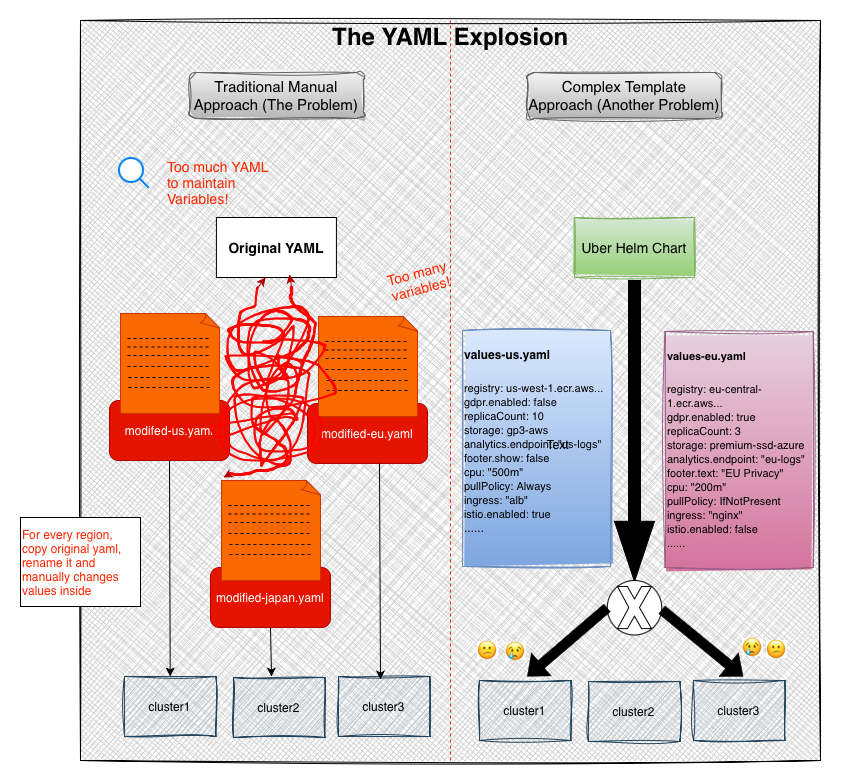
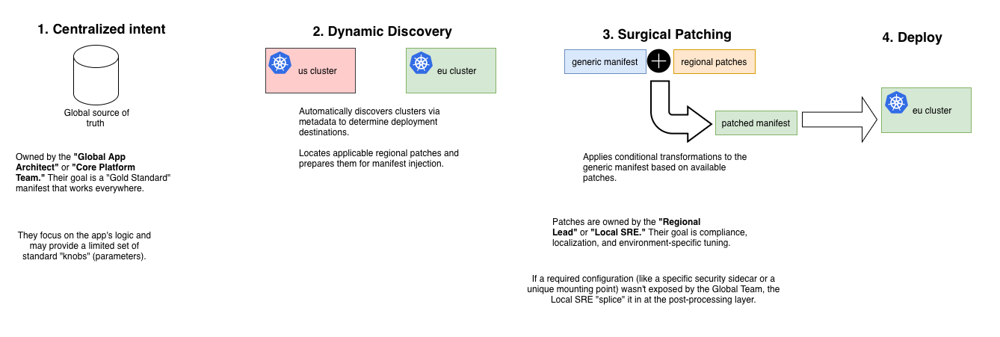
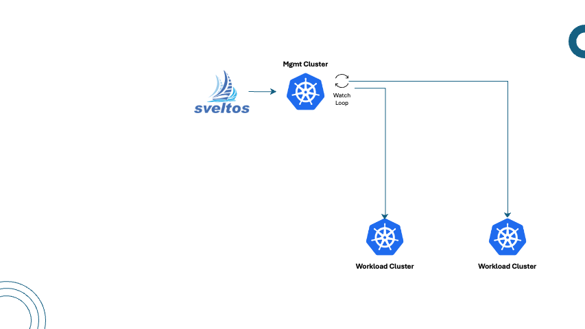
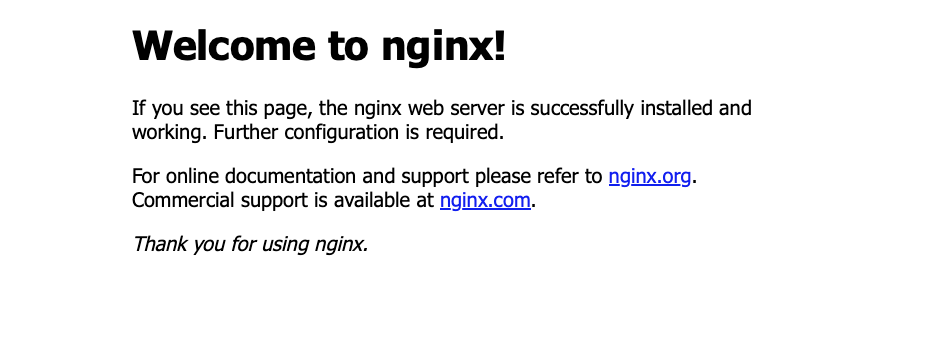
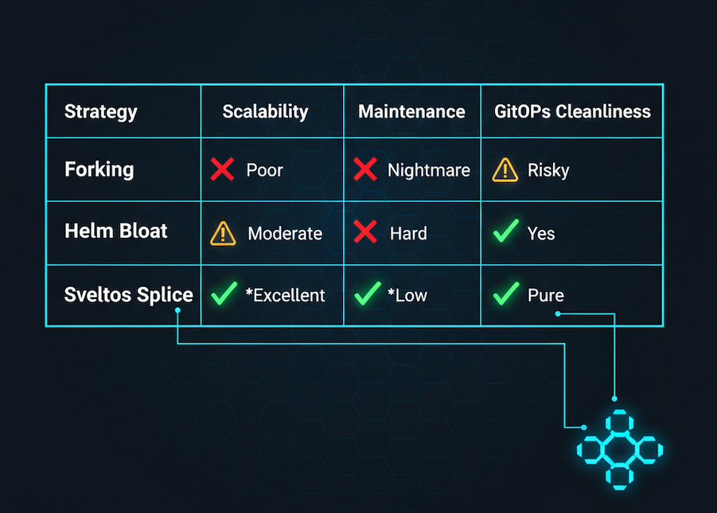

# Stop Forking Your YAML

**TL;DR**: Managing multi-cluster YAML usually leads to Copy-Paste drift or Helm-chart bloat. This post demonstrates how to use a surgical post-processor to decouple global application intent from regional infrastructure needs using Late-Binding.

## The Problem: The "Copy-Paste" Trap

In a traditional setup, when you have a core application that needs a slight tweak for a specific region (like our EU vs. US example), you generally have three bad options:

1. *The Forking Nightmare*: You create a `deployment-us.yaml` and a `deployment-eu.yaml`. This works for a week. Then, you update the container image in the US version but forget the EU version. Your clusters are now __drifting__, and your global consistency is broken.
2. *The Helm "Value" Bloat*: You try to make the Helm chart handle everything. You add __if/else__ blocks for every possible regional variable. Your `values.yaml` becomes a 2,000-line monster that is impossible to read, and you are still limited by what the original chart author decided to expose.
3. *Manual Intervention*: You deploy the base app and then have a human (or a fragile script) go in and manually patch the environment variables. This is the opposite of GitOps and is prone to human error.

The core of the problem is that **Location** is an infrastructure property, but **Configuration** is an application property. Standard tools force you to mix them.



## The Vision: A "Location-Aware" Delivery System

To solve the multi-cluster dilemma, we need to move away from traditional "template-and-deploy" models. A truly scalable solution should function like a **Surgical Post-Processor** - an intelligent layer that sits between your global source of truth and your local clusters.

A working solution must decouple **What** you are deploying from **Where** it is going. Here is how that ideal workflow functions in practice:

1. **Centralized Intent**
You define a single, global __Intent__. Instead of managing individual clusters, you manage **logical groups**. You simply state: "I want the Customer Portal application deployed to every cluster labeled app: portal." This keeps your configuration clean and centralized, regardless of whether you have ten clusters or ten thousand.

2. **Dynamic Discovery**
The system must be reactive. When a new cluster is provisioned - for example, in **France **- it should automatically be "discovered" by its metadata (e.g., location: europe). The deployment system sees this new destination and understands its unique identity without a human ever having to update a manual list.

3. **Surgical Patching (The "DNA Splice")**
This is the core of the solution. Instead of re-rendering an entire Helm chart with different values - which is often limited by what the chart developer allows - the system takes the final, fully-rendered YAML and "splices" in regional requirements.

4. **Overcoming the "Missing Knob" Bottleneck**
In traditional models, a Local SRE is often blocked if the Global App Architect didn't "expose a knob" (a parameter or variable) in the original template. With a Surgical Post-Processor, that dependency is broken:
    - **Global Team**: Maintains a clean, generic **Immutable** Core. They focus on the "Gold Standard" manifest that works everywhere.
    - **Local SRE**: If a regional requirement (like a specific security sidecar or a unique mounting point) isn't supported by the base template, the SRE creates an independent **External Patch**.
    - **The Result**: The system injects these "missing knobs" directly into the final manifest at runtime. Local teams no longer have to wait for Global PR approvals to meet urgent regional compliance or infrastructure needs.

5. **Late Binding**
Localization details should not be hardcoded into the application code or the main deployment manifest. Instead, they should exist as independent `Policy Packets` that are only bound to the application at the final moment of delivery. This ensures that the application remains generic and portable, while the regional nuances are managed as separate, modular entities.



## One Management Cluster. Infinite Possibilities. Total Control

[**Sveltos**](https://github.com/projectsveltos/addon-controller) is a set of Kubernetes controllers that run in a **central management cluster**. From this single point of control, Sveltos can manage add-ons and applications across a vast fleet of managed Kubernetes clusters. It is a strictly **declarative** tool: you define the "Desired State" on the management cluster, and Sveltos ensures that state is reflected in every managed cluster, automatically correcting any drift.
In the management cluster, each individual managed Kubernetes cluster is represented by a dedicated resource. Because these are standard Kubernetes resources, you can attach **Labels** to them to categorize your fleet by region, purpose, or compliance tier.
Sveltos configuration utilizes a concept called a **cluster selector**. This selector acts like a dynamic filter based on those Kubernetes labels. By defining specific labels or combinations of labels, you can create a subset of clusters that share those characteristics - such as all clusters located in "Europe."

### The Working Solution: Sveltos in Action
When you deploy our Customer Portal, Sveltos doesn't just push a static file. It follows a dynamic pipeline:

1. **Identify: The Cluster Selector**
Sveltos continuously monitors your fleet. It identifies a cluster because it matches a selector like env: prod and app: portal.
Contextualize: Discovery via Labels Sveltos looks at the cluster's metadata. If the cluster has the label location: europe, Sveltos uses that variable to dynamically "point" to your portal-patch-europe ConfigMap.

2. **The "Surgical Splice": patchesFrom in Action**
This is where the magic happens. Sveltos takes your generic "Vanilla" Deployment (the one that has no idea Europe exists) and your Generic ConfigMap, and performs two precise operations based on your YAML: 
    - **The ConfigMap Splice**: It injects the EU-specific HTML (`<h1>Welcome to the EU Portal</h1>`) into the regional-config object.
    - **The Deployment Splice**:  It adds a volume and a volumeMount to the customer-portal Deployment.

4. **Late Binding: The Final Result**
The application remains generic in your Git repository. The "EU-ness" is only bound to the application at the very last millisecond before the YAML is applied to the cluster.



## The Concrete Demo

Let's build it. We will use a simple **NGINX Deployment** as our "Customer Portal" and inject regional identity.
A Kind cluster is used as management cluster. Then two extra Civo clusters all with label `app=portal`.

```bash
+------------------------+-------------+-------------------------------------+
|    Cluster Name        |   Version   |             Comments                |
+------------------------+-------------+-------------------------------------+
|    site-us/portal      | v1.33.6-k3s1| Civo 3 Node - Medium Standard       |
|    site-eu/portal      | v1.32.5+k3s1| Civo 3 Node - Medium Standard       |
+------------------------+-------------+-------------------------------------+
```

1. **Install Sveltos on Managament Cluster**
For this tutorial, we will install Sveltos in the management cluster. Sveltos installation details can be found [here](https://projectsveltos.github.io/sveltos/latest/getting_started/install/install/).

```bash
kubectl apply -f https://raw.githubusercontent.com/projectsveltos/sveltos/v1.5.1/manifest/manifest.yaml
```

And [register](https://projectsveltos.github.io/sveltos/main/register/register-cluster/) the cluster with Sveltos

```bash
kubectl get sveltoscluster -A --show-labels
NAMESPACE   NAME     READY   VERSION        AGE     LABELS
site-eu     portal   true    v1.32.5+k3s1   3m43s   app=portal,location=europe
site-us     portal   true    v1.33.6+k3s1   4m20s   app=portal
```

2. **Define the Global Application (The "What")**
This is our generic manifest stored in a ConfigMap on the management cluster. It has no regional logic and stays 100% standardized.

```yaml
apiVersion: v1
kind: ConfigMap
metadata:
  name: portal-base-manifests
  namespace: default
data:
  deployment.yaml: |
    apiVersion: v1
    kind: Service
    metadata:
      name: portal-service
    spec:
      selector:
        app: portal
      ports:
      - protocol: TCP
        port: 80
        targetPort: 80
    ---
    apiVersion: v1
    kind: ConfigMap
    metadata:
      name: regional-config
    data: {} # Empty! No index.html yet.
    ---
    apiVersion: apps/v1
    kind: Deployment
    metadata:
      name: customer-portal
    spec:
      replicas: 1
      selector:
        matchLabels:
          app: portal
      template:
        metadata:
          labels:
            app: portal
        spec:
          volumes: []
          containers:
          - name: nginx
            image: nginx:latest
            volumeMounts: [] # Initialize here too
            env:
            - name: APP_MODE
              value: "production"
```

3. **Create the Regional Policy Packet (The "Late Binding")**
On the management cluster, we define the "EU-specific" instructions.

```yaml
apiVersion: v1
kind: ConfigMap
metadata:
  name: portal-patch-europe
  namespace: default
data:
  configmap-patch: |2
      target:
        kind: ConfigMap
        name: regional-config
      patch: |
        - op: add
          path: /data/index.html
          value: |
            <html><body><h1>Welcome to the EU Portal</h1></body></html>
  deployment-patch: |2
      target:
        kind: Deployment
        name: customer-portal
      patch: |
        - op: add
          path: /spec/template/spec/volumes/-
          value:
            name: html-volume
            configMap:
              name: regional-config
        - op: add
          path: /spec/template/spec/containers/0/volumeMounts/-
          value:
            name: html-volume
            mountPath: /usr/share/nginx/html/index.html
            subPath: index.html
```

4. **The Orchestrator (The ClusterProfile)**
This tells Sveltos how to tie the "What" to the "Where" using the **patchesFrom** logic.

```yaml
apiVersion: config.projectsveltos.io/v1beta1
kind: ClusterProfile
metadata:
  name: deploy-portal-fleet
spec:
  clusterSelector:
    matchLabels:
      app: portal

  policyRefs:
  - name: portal-base-manifests
    namespace: default
    kind: ConfigMap

  # The Surgical Splice logic
  patchesFrom:
  - kind: ConfigMap
    # The Power of Templating:
    # This dynamically resolves to 'portal-patch-europe' for EU clusters
    name: "portal-patch-{{ index .Cluster.metadata.labels \"location\" }}"
    namespace: default
    optional: true
```

With the ClusterProfile active, Sveltos acts as the intelligent orchestrator. It identifies the clusters, evaluates their metadata, and applies the "Surgical Splice" only where the conditions are met.

5. **Verification of Deployment**

Running `sveltosctl` confirms that the global intent has been successfully realized across our fleet. Both the US and EU clusters received the base application, but their internal configurations differ based on their labels.

```bash
sveltosctl show addons
┌────────────────┬─────────────────┬───────────┬─────────────────┬─────────┬───────────────────────────────┬─────────────────┬────────────────────────────────────┐
│    CLUSTER     │  RESOURCE TYPE  │ NAMESPACE │      NAME       │ VERSION │             TIME              │ DEPLOYMENT TYPE │              PROFILES              │
├────────────────┼─────────────────┼───────────┼─────────────────┼─────────┼───────────────────────────────┼─────────────────┼────────────────────────────────────┤
│ site-eu/portal │ :Service        │ default   │ portal-service  │ N/A     │ 2026-02-21 13:52:53 +0100 CET │ Managed cluster │ ClusterProfile/deploy-portal-fleet │
│ site-eu/portal │ :ConfigMap      │ default   │ regional-config │ N/A     │ 2026-02-21 13:52:53 +0100 CET │ Managed cluster │ ClusterProfile/deploy-portal-fleet │
│ site-eu/portal │ apps:Deployment │ default   │ customer-portal │ N/A     │ 2026-02-21 13:52:54 +0100 CET │ Managed cluster │ ClusterProfile/deploy-portal-fleet │
│ site-us/portal │ apps:Deployment │ default   │ customer-portal │ N/A     │ 2026-02-21 13:52:44 +0100 CET │ Managed cluster │ ClusterProfile/deploy-portal-fleet │
│ site-us/portal │ :Service        │ default   │ portal-service  │ N/A     │ 2026-02-21 13:52:43 +0100 CET │ Managed cluster │ ClusterProfile/deploy-portal-fleet │
│ site-us/portal │ :ConfigMap      │ default   │ regional-config │ N/A     │ 2026-02-21 13:52:44 +0100 CET │ Managed cluster │ ClusterProfile/deploy-portal-fleet │
└────────────────┴─────────────────┴───────────┴─────────────────┴─────────┴───────────────────────────────┴─────────────────┴────────────────────────────────────┘
```

The power of this approach is visible when we inspect the regional-config ConfigMap in both environments.

Since the US cluster does not have a location: europe label, the patchesFrom directive (which was marked as optional: true) simply skips the patching process. The result is the exact "Gold Standard" manifest defined by the Global Team.

```bash
kubectl get configmap regional-config
NAME              DATA   AGE
regional-config   0      109s
```

In the EU cluster, Sveltos detected the location: europe label. It dynamically resolved the patch name to portal-patch-europe and performed a JSON Patch at the moment of delivery.

```bash
kubectl get configmap regional-config
NAME              DATA   AGE
regional-config   1      106s
```

The ultimate test of our **Surgical Post-Processor** is what the end-user sees. By simply changing a label on the cluster, Sveltos has dynamically altered the application's behavior at the edge.




## Scaling Without the Friction

Multi-cluster management doesn't have to be a choice between "copy-paste" chaos and Helm-chart bloat. By shifting to a Surgical Post-Processing model with Sveltos, you decouple your global intent from local requirements.
This "late-binding" approach ensures that your core application remains immutable and easy to update, while regional nuances - from compliance headers to security sidecars - are injected dynamically at the edge. The result is a GitOps workflow that finally scales as fast as your infrastructure.
Stop forking your YAML and start orchestrating your intent.


