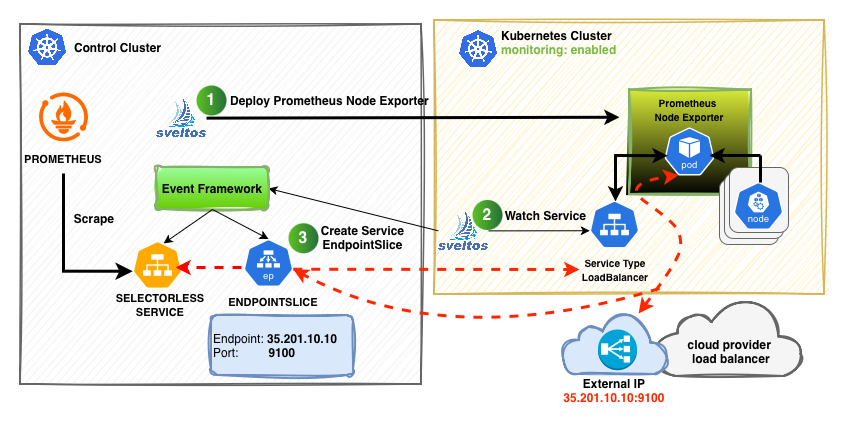
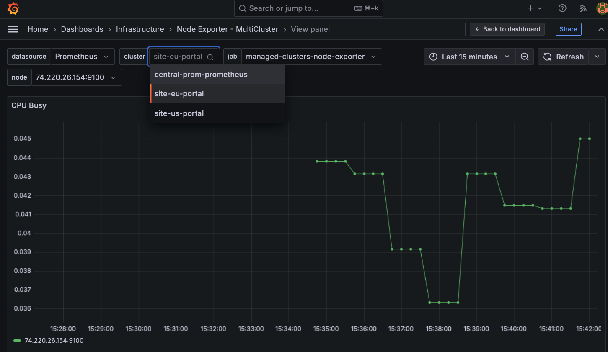
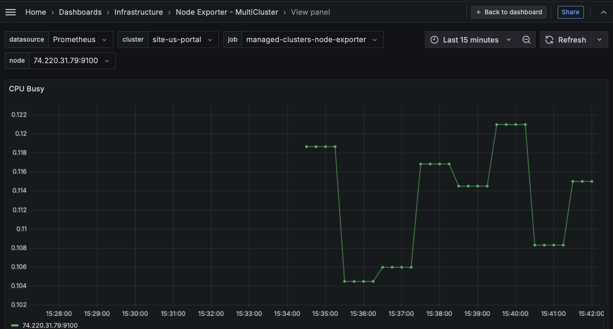

# Multi-Cluster Monitoring: Stop Managing Configs, Start Automating Infrastructure

## The Problem

In a modern Kubernetes environment, the “Brain” (Management Cluster) and the “Edge” (Managed Clusters) often live in separate worlds—different VPCs, different regions, or even different cloud providers. The goal is always the same: **Monitor everything from a single central point.**

However, the reality of achieving this is usually a manual nightmare. Most teams fall into the trap of manually modifying Prometheus configurations every time a new cluster is spun up or a Node Exporter IP changes. You find yourself constantly editing ConfigMaps, updating static targets, and restarting pods just to keep your dashboard from showing “No Data.”

This manual “plumbing” doesn’t scale. It leads to human error, configuration drift, and a monitoring system that is always one step behind your actual infrastructure. We wanted a system where we **never touch a configuration file again.** We wanted the infrastructure to “announce” itself and have the central management cluster automatically adapt.


---

## The Engine: What is Project Sveltos?

To break free from manual updates, we use [**Project Sveltos**](https://github.com/projectsveltos). While many think of Kubernetes management as simply “pushing YAML,” Sveltos is a sophisticated multi-cluster orchestration engine designed for scale and autonomy.

At its core, Sveltos is a declarative tool that manages the entire lifecycle of cluster add-ons and applications. It allows platform engineers to define **ClusterProfiles**—blueprints that specify exactly which Helm charts, raw YAML manifests, or even Meshed resources should exist on which clusters based on simple labels. If you label a cluster `env: prod`, Sveltos ensures the production stack is deployed and, more importantly, stays compliant.

But Sveltos goes far beyond simple deployment. It features a powerful **Event Framework** that allows it to “listen” to the state of your managed clusters. It can detect when a resource is created, modified, or deleted in a remote region and trigger a specific “remediation” action in response. This bidirectional intelligence is what allows us to move from static deployments to **adaptive infrastructure**—where the Management Cluster actually reacts to what is happening at the Edge.

---

## Phase 1: Automated Add-on Deployment

Before the events can fire, Sveltos establishes the foundation. We use Sveltos to deploy the core monitoring components as standardized add-ons:

* **Centralized Brain:** Sveltos deploys **Prometheus** into the **Management Cluster**.
* **Remote Agents:** For every managed cluster labeled with `monitoring: enabled`, Sveltos deploys the **Node Exporter**.
* **The Public Gateway:** Crucially, Sveltos deploys the Node Exporter with a `Service` of `type: LoadBalancer`. This ensures that each managed cluster provisioned by Sveltos automatically requests an External IP from the cloud provider (like Civo), creating a reachable entry point for our central Prometheus.

---

## Phase 2: The Sveltos Event Framework & Auto-Discovery



Once the agents are live, the **Sveltos Event Framework** handles the “networking plumbing” while Prometheus handles the “service discovery.”

### 1. The “Watch” Event (IP Discovery)
A Sveltos **EventSource** acts as a remote sensor, “watching” for the Node Exporter Service to receive its **External IP**. Once detected, Sveltos triggers a remediation that creates a **local placeholder** (a Selector-less Service and an EndpointSlice) in the Management Cluster.

Think of this as a **“Local Shadow”**: Prometheus thinks it’s talking to a service inside the management cluster, but that service is actually a transparent tunnel pointing directly to the remote cluster’s IP.

### 2. The Prometheus “Auto-Pilot” Config
To ensure we never have to edit the Prometheus config again, we use **Relabeling Rules**. Instead of hardcoding IPs, we tell Prometheus: *“Automatically scrape any local service that looks like a Node Exporter.”*

### The Result: Transparent, Zero-Touch Scraping
Because of this loop, the workflow for adding a new cluster is now:

1.  Label a cluster `monitoring: enabled`.
2.  **Sveltos** deploys the exporter and finds the IP.
3.  **Sveltos** creates a **local shadow service** in the management cluster.
4.  **Prometheus** detects the new shadow service and starts scraping immediately.

**Zero configuration files were edited.** If you add 100 clusters, they simply “pop up” in your Grafana dashboard automatically.

---

## The Concrete Demo: Step-by-Step Implementation

To demonstrate this architecture, we are using a **Kind** cluster as our Management Hub and two remote **Civo** clusters as our managed entities.


```bash
+------------------------+-------------+-------------------------------------+
|    Cluster Name        |   Version   |             Comments                |
+------------------------+-------------+-------------------------------------+
|    site-us/portal      | v1.35.0+k3s1| Civo 3 Node - Medium Standard       |
|    site-eu/portal      | v1.32.5+k3s1| Civo 3 Node - Medium Standard       |
+------------------------+-------------+-------------------------------------+
```

### Step 1: Initialize the Sveltos Control Plane
First, we install Sveltos into our management cluster. This acts as the “brain” that coordinates the multi-cluster events. Sveltos installation details can be found [here](https://projectsveltos.github.io/sveltos/main/getting_started/install/install/).

```bash
kubectl apply -f [https://raw.githubusercontent.com/projectsveltos/sveltos/v1.5.1/manifest/manifest.yaml](https://raw.githubusercontent.com/projectsveltos/sveltos/v1.5.1/manifest/manifest.yaml)
```

**💡 Important: Labeling the Management Cluster**

Sveltos can manage the cluster it is installed on (the "Local" cluster). To ensure our central Prometheus and Grafana are deployed to the right place, we must label the management cluster with `type: mgmt`.

Once installed, we register our Civo clusters. Notice the `monitoring=enabled` label-this is the "trigger" that Sveltos uses to identify which clusters belong to our observability fleet.

```bash
kubectl get sveltoscluster -A --show-labels
NAMESPACE   NAME     READY   VERSION        AGE     LABELS
site-eu     portal   true    v1.32.5+k3s1   3m43s   monitoring=enabled
site-us     portal   true    v1.33.6+k3s1   4m20s   monitoring=enabled
```

### Step 2: Define the "What" (ClusterProfiles)

We use Sveltos **ClusterProfiles** to define the desired state of our entire fleet. We need two profiles: one for the central collector and one for the remote agents.

**A. The Central Collector (Prometheus)**
This profile targets the management cluster. It configures Prometheus with specific **Relabeling Rules** to automatically discover the "Shadow" services Sveltos will create.

```yaml
apiVersion: config.projectsveltos.io/v1beta1
kind: ClusterProfile
metadata:
  name: deploy-central-prometheus
spec:
  clusterSelector:
    matchLabels:
      type: mgmt
  syncMode: Continuous
  helmCharts:
  - repositoryURL: https://prometheus-community.github.io/helm-charts
    repositoryName: prometheus-community
    chartName: prometheus-community/prometheus
    chartVersion: 28.12.0
    releaseName: central-prom
    releaseNamespace: monitoring
    values: |
      scrapeConfigs:
        managed-clusters-node-exporter:
          enabled: true
          honor_labels: true
          # CHANGE: Use endpointslice role to find the actual IPs
          kubernetes_sd_configs:
            - role: endpointslice
              namespaces:
                names:
                  - monitoring
          relabel_configs:
            # 1. Only keep targets from services ending in -node-exporter
            - source_labels: [__meta_kubernetes_service_name]
              action: keep
              regex: '.*-node-exporter'
            # 2. Extract the cluster name for the 'cluster' label
            - source_labels: [__meta_kubernetes_service_name]
              target_label: cluster
              regex: '(.*)-node-exporter'
              replacement: '${1}'
            # 3. Use the IP from the EndpointSlice and the port defined in the service
            - source_labels: [__address__, __meta_kubernetes_endpointslice_port_number]
              action: replace
              target_label: __address__
              regex: ([^:]+)(?::\d+)?;(\d+)
              replacement: $1:$2
```

**B. The Remote Agent (Node Exporter)**

This profile targets any cluster labeled `monitoring: enabled`. Crucially, we override the service type to LoadBalancer so the cloud provider assigns an External IP that Sveltos can track.

```bash
apiVersion: config.projectsveltos.io/v1beta1
kind: ClusterProfile
metadata:
  name: deploy-node-exporter
spec:
  # 1. Target clusters with the specific label
  clusterSelector:
    matchLabels:
      monitoring: enabled

  syncMode: Continuous

  # 2. Define the Helm Chart
  helmCharts:
  - repositoryURL: https://prometheus-community.github.io/helm-charts
    repositoryName: prometheus-community
    chartName: prometheus-community/prometheus-node-exporter
    releaseName: node-exporter
    releaseNamespace: monitoring
    chartVersion: 4.40.0

    # 3. Override values to use a LoadBalancer
    values: |
      service:
        type: LoadBalancer
        port: 9100
        targetPort: 9100
        # Optional: For cloud providers, you may want an internal LB
        # annotations:
        #   service.beta.kubernetes.io/aws-load-balancer-internal: "true"
```


After posting your ClusterProfiles, Sveltos immediately goes to work. Instead of manually checking every managed cluster, you can verify the status of all deployments from the **Management Cluster** by checking the **ClusterSummary** resources.
A ClusterSummary is a Sveltos-generated resource that tracks the deployment status of a specific profile for a specific cluster. Run the following command:

```bash
kubectl get clustersummary -A  -o wide
NAMESPACE   NAME                                     AGE   HELMCHARTS    KUSTOMIZEREFS   POLICYREFS
mgmt        deploy-central-prometheus-sveltos-mgmt   35s   Provisioned
site-eu     deploy-node-exporter-sveltos-portal      21s   Provisioned
site-us     deploy-node-exporter-sveltos-portal      21s   Provisioned
```

### Step 3: The Event Framework (The "How")

This is the most critical phase. We use the [Sveltos Event Framework](https://projectsveltos.github.io/sveltos/main/events/addon_event_deployment/) to bridge the gap between our remote Civo clusters and our central Prometheus.

We define an **EventSource** to watch the remote clusters and an **EventTrigger** to react by creating "shadow" resources in the management cluster.

**1. The Sensor: EventSource**
The `EventSource` tells Sveltos exactly what to look for. In this case, we are monitoring the monitoring namespace in every managed cluster for the specific Node Exporter service.

```yaml
apiVersion: lib.projectsveltos.io/v1beta1
kind: EventSource
metadata:
  name: node-exporter-service
spec:
  collectResources: true
  resourceSelectors:
  - group: ""
    version: "v1"
    kind: "Service"
    namespace: monitoring
    name: node-exporter-prometheus-node-exporter
```

**2. The Brain: EventTrigger**

The `EventTrigger` defines the causality: "When the Service is found in a source cluster, execute a policy in the destination cluster (the management hub)."
Crucially, it references a `ConfigMap` containing the template for our shadow resources.

```yaml
apiVersion: lib.projectsveltos.io/v1beta1
kind: EventTrigger
metadata:
  name: node-exporter
spec:
  destinationCluster:
    kind: SveltosCluster
    namespace: mgmt
    name: mgmt
    apiVersion: lib.projectsveltos.io/v1beta1
  sourceClusterSelector:
    matchLabels:
      monitoring: enabled
  eventSourceName: node-exporter-service
  oneForEvent: true
  policyRefs:
  - name: selectorless-node-exporter
    namespace: default
    kind: ConfigMap
```

**3. The Automation: Template for Shadow Resources**

The final piece is the `ConfigMap`. Using Sveltos's template instantiation, we dynamically generate a **Selector-less Service** and an **EndpointSlice** in the management cluster.
Sveltos automatically pulls the **External IP** from the remote service's `.status.loadBalancer.ingress` and injects it into the local EndpointSlice.

```yaml
apiVersion: v1
kind: ConfigMap
metadata:
  name: selectorless-node-exporter
  namespace: default
  annotations:
    projectsveltos.io/instantiate: ok
data:
  selectorless-service.yaml: |
    kind: Service
    apiVersion: v1
    metadata:
      name: {{ .Cluster.metadata.namespace }}-{{ .Cluster.metadata.name }}-node-exporter
      namespace: monitoring
    spec:
      type: ClusterIP
      ports:
      - port: 9100
        targetPort: 9100
    ---
    apiVersion: discovery.k8s.io/v1
    kind: EndpointSlice
    metadata:
     name: {{ .Cluster.metadata.namespace }}-{{ .Cluster.metadata.name }}-node-exporter
     namespace: monitoring
     labels:
        kubernetes.io/service-name: {{ .Cluster.metadata.namespace }}-{{ .Cluster.metadata.name }}-node-exporter
    addressType: IPv4
    endpoints:
    - addresses:
      - {{ (index .Resource.status.loadBalancer.ingress 0).ip }}
      conditions:
        ready: true
    ports:
    - name: metrics
      port: 9100
      protocol: TCP
```

Once the Sveltos **EventTrigger** is active, it detects the LoadBalancer IPs from your remote Civo clusters and automatically creates the local placeholders in your Management Cluster.
You can verify this by checking the services and endpoint slices in the monitoring namespace of your **Management Cluster**.

**Checking the Services**

Run the following command to see the local "Shadow" services:

```bash
kubectl get service -n monitoring | grep node-exporter
```

```bash
NAME                                    TYPE        CLUSTER-IP      EXTERNAL-IP   PORT(S)    AGE
central-prom-prometheus-node-exporter   ClusterIP   10.115.106.86   <none>        9100/TCP   3m52s
site-eu-portal-node-exporter            ClusterIP   10.115.179.78   <none>        9100/TCP   93s
site-us-portal-node-exporter            ClusterIP   10.115.4.89     <none>        9100/TCP   93s
```

**Checking the EndpointSlices (The Magic Link)**

This is where the real work happens. Notice how the site-eu and site-us slices don't point to local pod IPs, but to the **Public External IPs** of your Civo clusters:

```bash
kubectl get endpointslice -n monitoring | grep node-exporter
```

```bash
NAME                                          ADDRESSTYPE   PORTS   ENDPOINTS                          AGE
central-prom-prometheus-node-exporter-9wwz7   IPv4          9100    172.18.0.5,172.18.0.4,172.18.0.6   18m
site-eu-portal-node-exporter                  IPv4          9100    74.220.26.154                      27s
site-us-portal-node-exporter                  IPv4          9100    74.220.31.79                       28s
```

### Step 4: Multi-Cluster Dashboards via GitOps

Now that Sveltos has plumbed the network and Prometheus is scraping the remote clusters, we need a way to visualize the data. Instead of manually importing JSON files, we deploy a **ConfigMap** containing our dashboard definition.

**Note**: We deploy this __before__ Grafana so that as soon as the Grafana pod initializes, its sidecar can find and load the dashboard immediately.
Because we added the cluster label in our Prometheus relabeling rules earlier, we can now use a template variable in Grafana to switch between our site-us and site-eu clusters seamlessly.

```yaml
apiVersion: v1
kind: ConfigMap
metadata:
  name: node-exporter-dashboard
  namespace: monitoring
  labels:
    grafana_dashboard: "1" # This triggers the Grafana sidecar
data:
  node-exporter-full.json: |-
    {
      "title": "Node Exporter - MultiCluster",
      "templating": {
        "list": [
          {
            "name": "cluster",
            "type": "query",
            "datasource": "Prometheus",
            "definition": "label_values(node_uname_info, cluster)",
            "refresh": 1
          }
        ]
      },
      "panels": [
        {
          "title": "CPU Busy",
          "type": "timeseries",
          "targets": [
            {
              "expr": "sum by (instance) (irate(node_cpu_seconds_total{cluster=\"$cluster\"}[5m]))",
              "legendFormat": "{{instance}}"
            }
          ]
        }
      ]
    }
```

**The Visualization Layer (Grafana)**

To see our metrics, we deploy **Grafana** into the Management Cluster. We configure it to automatically point to our central Prometheus instance and enable the Sidecar feature. This sidecar is vital: it watches for ConfigMaps with a specific label and "hot-loads" them as dashboards.

```bash
apiVersion: config.projectsveltos.io/v1beta1
kind: ClusterProfile
metadata:
  name: deploy-central-grafana
spec:
  clusterSelector:
    matchLabels:
      type: mgmt
  syncMode: Continuous
  helmCharts:
  - repositoryURL: https://grafana-community.github.io/helm-charts
    repositoryName: grafana-community
    chartName: grafana-community/grafana
    chartVersion: 8.5.12
    releaseName: central-grafana
    releaseNamespace: monitoring
    values: |
      adminPassword: "admin"
      datasources:
        datasources.yaml:
          apiVersion: 1
          datasources:
          - name: Prometheus
            type: prometheus
            url: http://central-prom-prometheus-server:80
            isDefault: true
      sidecar:
        dashboards:
          enabled: true
          label: grafana_dashboard # Sidecar looks for this label
          labelValue: "1"
          searchNamespace: monitoring
          folder: /var/lib/grafana/dashboards/provisions
```

**The Grand Finale: One Dashboard, Many Clusters**

The true power of this setup isn't just that it's automated - it's that it's **seamlessly unified.**
Because of our Prometheus relabeling rules and the Grafana template variables, your single dashboard now acts as a global command center. By simply toggling the Cluster dropdown at the top of the screen, we can switch views between geographically dispersed regions.





## Conclusion: Why This Matters

We started with a problem: **Manual configurations don't scale**. By using Project Sveltos, we've built an infrastructure that **observes itself**. We no longer care about remote IP addresses, VPN tunnels, or static Prometheus target lists.

1. We **label** a cluster.
2. Sveltos **deploy**s the agents.
3. The Event Framework **plumbs** the network.
4. Prometheus and Grafana **auto-discover** the new data.

This is the future of platform engineering: moving away from being "YAML janitors" and becoming "Architects of Automation."