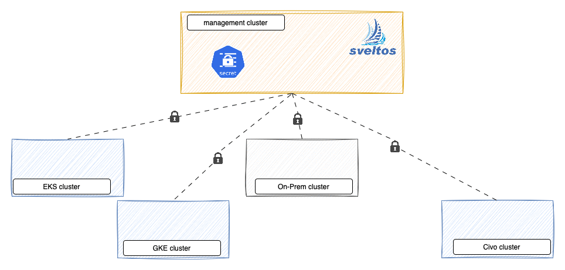

Secrets, like API keys, passwords, and certificates, are critical confidential data. Centralized secret management across Kubernetes clusters offers key benefits: improved visibility, simplified updates, and enhanced security. 
By managing secrets in one location, you gain a clear overview, automate updates to all clusters, and can quickly isolate compromised clusters by revoking their access through label changes.

## What is Sveltos?

[Sveltos](https://github.com/projectsveltos) is a set of Kubernetes controllers that run in the management cluster. From the management cluster, Sveltos can manage add-ons and applications on a fleet of managed Kubernetes clusters. 
It is a declarative tool to ensure that the desired state of an application is always reflected in the actual state of the Kubernetes managed clusters.

Sveltos installation details can be found [here](https://projectsveltos.github.io/sveltos/getting_started/install/install/).

## Distrubute Secret to all Production clusters

Sveltos is used to manage four Kubernetes clusters: EKS, GKE, Civo, and an on-premises deployment. The EKS, GKE, and Civo clusters share the label `env: production`.

A secret created in the management cluster is then distributed by Sveltos to the production clusters.



Create Secret

```bash
kubectl create secret generic -n default login-credential --from-literal=username=admin --from-literal=password=mypassword
```

Post the Sveltos configuration:

```yaml
apiVersion: config.projectsveltos.io/v1beta1
kind: ClusterProfile
metadata:
  name: deploy-resources
spec:
  clusterSelector: # Deploy to all cluster with label env: production
    matchLabels:
      env: production
  templateResourceRefs:
  - resource: # Fetch the Secret from the management cluster
      apiVersion: v1
      kind: Secret
      name: login-credentials
      namespace: default
    identifier: Credentials
  policyRefs: # Use this ConfigMap as a template and deploy its content, populating it with data from the referenced Secret.
  - kind: ConfigMap
    name: info
    namespace: default
---
apiVersion: v1
kind: ConfigMap
metadata:
  name: info
  namespace: default
  annotations:
    projectsveltos.io/template: "true"  # add annotation to indicate Sveltos content is a template
data:
  secret.yaml: |
    {{ copy "Credentials" }}
```

This YAML configuration tells Sveltos to perform three actions. First, it fetches the `login-credentials` Secret from the `default` namespace. 
Second, it takes the `info` ConfigMap from the `default` namespace, uses it as a template, and deploys the instantiated content using data from the `login-credentials` Secret. 
Finally, it deploys the `login-credentials` Secret to all Kubernetes clusters with the env: production label.

## Automating Secret Deployment with Event-Based Triggers

Imagine you have a multi-cluster Kubernetes environment where different teams or applications need access to specific secrets. 
Instead of manually deploying these secrets to each cluster or pre-provisioning them, you want a more dynamic and automated approach.

By using Sveltos to monitor for events like the creation of namespaces with certain labels (e.g., `credentials: required`), you can automatically trigger the deployment of relevant secrets.


```yaml
apiVersion: lib.projectsveltos.io/v1beta1
kind: EventSource
metadata:
  name: requiring-credentials
spec:
  collectResources: true
  resourceSelectors:
  - group: ""
    version: "v1"
    kind: "Namespace"
    labelFilters:
    - key: credentials
      operation: Equal
      value: required
---
apiVersion: lib.projectsveltos.io/v1beta1
kind: EventTrigger
metadata:
  name: distribute-credentials
spec:
  sourceClusterSelector:
    matchLabels:
      env: production
  eventSourceName: requiring-credentials
  templateResourceRefs:
  - resource:
      apiVersion: v1
      kind: Secret
      name: login-credentials
      namespace: default
    identifier: Credentials
  - resource: # This refers to the resource that Sveltos dynamically generates using ConfigMapGenerator.
      apiVersion: v1
      kind: ConfigMap
      name: "{{ .Cluster.metadata.namespace }}-{{ .Cluster.metadata.name }}-namespaces"
      namespace: projectsveltos
    identifier: Namespaces
  configMapGenerator:
  - name: namespaces
    namespace: default
    nameFormat: "{{ .Cluster.metadata.namespace }}-{{ .Cluster.metadata.name }}-namespaces"
  policyRefs:
  - kind: ConfigMap
    name: info
    namespace: default
---
apiVersion: v1
kind: ConfigMap
metadata:
  name: namespaces 
  namespace: default
  annotations:
    projectsveltos.io/instantiate: "true"
data:
  namespaces: |
    {{- range $v := .MatchingResources }}
       {{ $v.Name }}: "ok"
    {{- end }} 
---
apiVersion: v1
kind: ConfigMap
metadata:
  name: info
  namespace: default
  annotations:
    projectsveltos.io/template: "true"  # add annotation to indicate Sveltos content is a template
data:
  secret.yaml: |
    {{ $namespaces := ( ( index (getResource "Namespaces").data "namespaces" ) | fromYaml ) }}
    {{- range $key, $value := $namespaces }}
        apiVersion: v1
        kind: Secret
        metadata:
          namespace: {{ $key }}
          name: {{ (getResource "Credentials").metadata.name }}
        data:
          {{- range $secretKey, $secretValue := (getResource "Credentials").data }}
            {{ $secretKey }} : {{ $secretValue }}
          {{- end }}
    ---
    {{- end }}
```

This Sveltos configuration automates the targeted deployment of the `login-credentials` secret. It monitors your production Kubernetes clusters for the creation of new namespaces labeled `credentials: required`. 
Upon detection, Sveltos automatically deploys the `login-credentials` secret into those specific namespaces.

This allows for dynamic, targeted, and automated secret distribution, ensuring that secrets are only deployed where and when they are needed.


## Contact Information

If you have some questions, would like to have a friendly chat or just network to not miss any topics, then don't use the comment function at medium, just feel free to add me to your [LinkedIn](https://www.linkedin.com/in/gianlucamardente/) network!